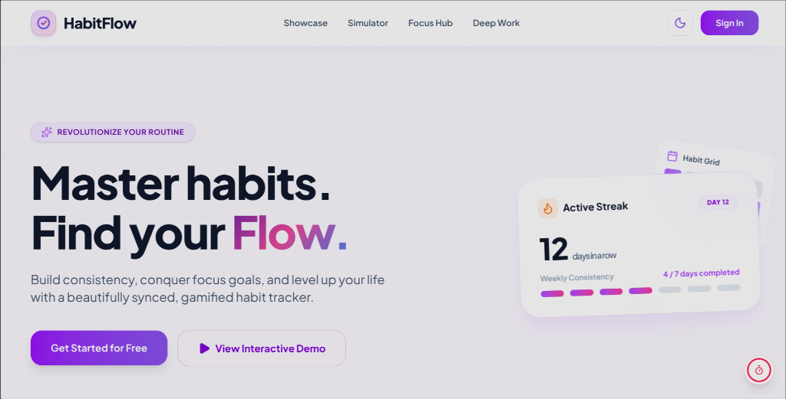

# 🚀 HabitFlow

A premium, visually-rich, offline-first habit tracker and SMART goal planner with **real-time cloud sync** and **9 advanced AI-powered intelligence features**.

[](https://habit-flow-ochre-two.vercel.app)
[](https://nextjs.org)
[](https://supabase.com)
[](https://typescriptlang.org)
[](https://playwright.dev)

---

## 🌟 Visual Showcase

### Interactive Dashboard & Workspace Bento Grid


---

## 📖 Table of Contents
1. [Core Features](#-core-features)
2. [RPG Gamification Mechanics](#-rpg-gamification-mechanics)
3. [9 Premium AI Features](#-9-premium-ai-features)
4. [Offline-First Sync Architecture](#-offline-first-sync-architecture)
5. [E2E Testing Suite](#-e2e-testing-suite)
6. [Tech Stack](#-tech-stack)
7. [Environment Configuration](#-environment-configuration)
8. [Quick Start & Setup](#-quick-start--setup)
9. [Deployment](#-deployment)
10. [License](#-license)

---

## ✨ Core Features

### 1. Habit Loop Tracking
- **Habit Grid View**: Displays weekly and monthly completion history using a responsive, fluid grid.
- **Dynamic Difficulty**: Set habit difficulty (Easy, Medium, Hard) to adjust XP/Gem rewards proportionally.
- **Archiving & Templates**: Temporarily archive completed habits or use evidence-based templates (Health, Finance, Focus, Creativity) to build routines instantly.

### 2. Task Checklist & Board
- **Checklist**: Responsive checklist for tracking daily tasks.
- **Drag-and-Drop Widgets**: Arrange today's tasks directly within a customizable, draggable Bento grid.
- **Subtask Boards**: Break down checklist tasks into multiple micro-subtasks with their own tracking metrics.

### 3. SMART Goal Planning
- **Goal Deadlines**: Track long-term achievements with deadline countdowns.
- **Milestones**: Breakdown objectives into progress-tracked sub-milestones with automated estimated durations.
- **Momentum Score**: Tracks daily goals combined with habit completion rates to compute a real-time progress momentum indicator.

### 4. Custom Workspace Toggles
- **Habit-Only Mode**: Toggle settings to strip out Tasks and Goals, turning HabitFlow into a ultra-minimalist habit-focused tracker.
- **Module Settings**: Enable/disable Tasks and Goals & Milestones with reactive visual fade-outs and link-filtering across headers and dashboard grids.

---

## 🎮 RPG Gamification Mechanics

HabitFlow turns productivity into an interactive role-playing game (RPG) featuring level progressions, stats, and shields:

- **XP & Level Progressions**: Completing habits and goals yields Experience Points (XP). Level up as your XP bar fills!
- **Stats Attribution**: Core habits contribute directly to developer-centric RPG stats (Vitality, Intelligence, Discipline, Charisma, Wealth, Creativity).
- **Gem Economy**: Earn virtual Gems upon completing daily checklists or achieving streak milestones.
- **Streak Freeze & Shields**: Protect your active habit streaks! Retroactively freeze missed days from the past 7 days. Purchase **Streak Shields** in the Gem shop on-the-fly to safeguard your progress.

---

## 🧠 9 Premium AI Features

HabitFlow boasts an advanced server-side AI intelligence layer powered by **Gemini 2.0 Flash** with persistent caching to remain 100% free-tier compatible.

| AI Feature | API Endpoint | Description | Cache TTL |
| :--- | :--- | :--- | :--- |
| 🎙️ **AI Coach Briefing** | `/api/ai/coach` | Daily diagnostic of your tasks/habits with highly personalized, actionable advice. | `6 Hours` |
| ⚡ **Task Prioritization** | `/api/ai/prioritize-task` | Organizes your cluttered daily checklist into a structured, high-to-low priority matrix. | `6 Hours` |
| 🏃 **Habit Recommendations** | `/api/ai/recommend-habits` | Analyzes historical routines to recommend fresh, scientific habits suited for you. | `24 Hours` |
| 🚨 **Burnout Detection** | `/api/ai/burnout-check` | Proactive monitoring of task load/streak decay to warn you before fatigue hits. | `4 Hours` |
| 🛠️ **Subtask Generation** | `/api/ai/generate-subtasks` | Instantly decomposes massive, intimidating projects into manageable, bite-sized tasks. | `None` |
| 🎯 **Milestone Generator** | `/api/ai/generate-milestones` | Breaks down long-term SMART goals into a 4-7 milestone path with custom deadlines. | `7 Days` |
| 🔗 **Smart Habit Stacking** | `/api/ai/suggest-habit-stacks` | Pairs new habits to existing triggers (e.g., "After I do X, I will immediately do Y"). | `3 Days` |
| 💭 **Personalized Quote Generator** | `/api/ai/personalize-quote` | Generates mood-aligned, context-aware motivational quotes based on daily success. | `6 Hours` |
| 📝 **Evidence-Based Descriptions** | `/api/ai/generate-habit-description` | Provides scientific benefits, common pitfalls, and actionable tips for custom habits. | `30 Days` |

---

## 🔄 Offline-First Sync Architecture

HabitFlow implements a modern, resilient offline-first design to guarantee zero-latency performance even with patchy networks.

```mermaid
graph TD
    User([User Action]) -->|1. Write| LocalDB[(IndexedDB / Dexie)]
    LocalDB -->|2. Fast UI Update| UI[Client View]
    
    subgraph SyncEngine [SyncCoordinator]
        LocalDB -->|3. Check isDirty flags| Sync[Sync Engine]
        Sync -->|4. Push Batch (Logical Counters)| Supabase[(Supabase Cloud)]
        Supabase -->|5. Broadcast Updates| Realtime[Supabase Realtime]
        Realtime -->|6. Merge Pull| LocalDB
    end
```

### 1. IndexedDB Client (Dexie.js)
All mutations (Habits, Completions, Tasks, Goals) write instantly to a local IndexedDB instance, allowing the UI to react under **<100ms** latency without waiting for network responses.

### 2. State & Conflict Resolution
- **Generation Counters**: Every row is tracked using a `generationCounter` logical timestamp.
- **Sync Engine**: When connection is restored, a background `SyncCoordinator` bulk-pushes dirty records (`isDirty: true`) to Supabase.
- **Last-Write-Wins**: Conflicts are resolved dynamically by matching and upgrading generation counters during sync loops.

---

## 🧪 E2E Testing Suite

HabitFlow includes a production-ready, highly-isolated end-to-end (E2E) testing suite engineered using **Playwright**.

### Key Architectural Highlights
- **Page Object Model (POM)**: Abstracted locators and helper functions into reusable `AuthPage`, `DashboardPage`, and `HabitsPage` classes.
- **Isolated User Lifecycle**: Every test creates a temporary test user in Supabase and automatically purges all related tables and records upon completion to prevent leakages.
- **Browser-side IndexedDB Seeding**: Standardized database clear and seed operations running evaluated code directly within standard IndexedDB transactions.

### Running E2E Tests
To execute all Playwright E2E tests locally:
```bash
CI=true npx playwright test
```

---

## 🛠 Tech Stack

- **Framework**: Next.js 16 (App Router), React 19, TypeScript 5.0
- **Styling**: Tailwind CSS v4, Lucide Icons, Framer Motion
- **State Management**: Zustand (Unified Cross-Domain Action Mediator)
- **Local Persistence**: IndexedDB (Dexie.js)
- **Cloud Backend**: Supabase (PostgreSQL, Auth, Realtime Sync, RLS Policies)
- **Testing**: Playwright (E2E), Vitest & React Testing Library (Unit/Integration)
- **API Model**: Google @google/genai SDK (Gemini 2.0 Flash)

---

## ⚙️ Environment Configuration

Create a `.env.local` file in the root directory:

```env
# Supabase Backend Configuration
NEXT_PUBLIC_SUPABASE_URL=https://your-supabase-url.supabase.co
NEXT_PUBLIC_SUPABASE_ANON_KEY=eyJhbGciOiJIUzI1NiIsInR5cCI6IkpXVCJ9...
SUPABASE_SERVICE_ROLE_KEY=eyJhbGciOiJIUzI1NiIsInR5cCI6IkpXVCJ9...

# App URL Configuration
NEXT_PUBLIC_APP_URL=http://localhost:3000

# Google AI Core Configuration
GEMINI_API_KEY=AIzaSy...

# Optional Rate Limiting — Upstash Redis (falls back to in-memory)
UPSTASH_REDIS_REST_URL=https://your-upstash-redis.upstash.io
UPSTASH_REDIS_REST_TOKEN=your_token_here
```

---

## 🏁 Quick Start & Setup

### 1. Setup Your Database
1. Create a project at [Supabase](https://supabase.com).
2. Open the **SQL Editor** in the Supabase Dashboard.
3. Paste and run the contents of [supabase-schema-fresh.sql](./supabase-schema-fresh.sql) to initialize the base tables, trigger functions, RLS policies, and sync support indexes.

### 2. Install Dependencies
```bash
npm install
```

### 3. Launch Development Server
```bash
npm run dev
```
Open [http://localhost:3000](http://localhost:3000) to view the application.

### 4. Verify Code Quality
```bash
npm run typecheck  # Run TypeScript compiler checks
npm run test       # Run unit and integration tests
CI=true npm run test:e2e  # Run end-to-end tests
```

---

## 🚀 Deployment

### Deploying to Vercel
Deploying is seamless using the Vercel Platform:

```bash
vercel
```

Ensure all your environmental variables (especially `GEMINI_API_KEY`, `SUPABASE_SERVICE_ROLE_KEY`, and `NEXT_PUBLIC_SUPABASE_URL`) are loaded securely inside the Vercel project configuration dashboard.

---

## 📄 License

This project is licensed under the MIT License.

---

**Build better habits, levels stats, and achieve your SMART goals with HabitFlow.** 🚀
