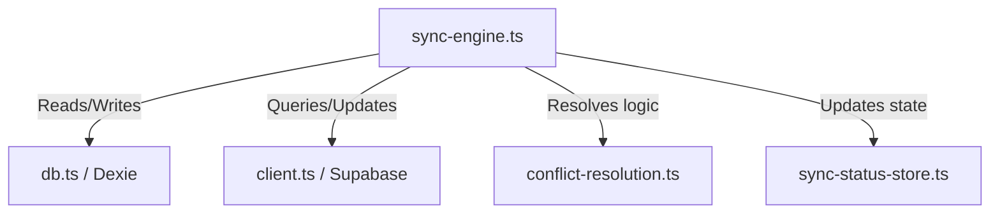

# Knowledge Capture: Sync Engine

Structured analysis and architectural overview of the offline-first synchronization engine (`SyncEngine`) in HabitFlow.

---

## Overview
The `SyncEngine` in HabitFlow is responsible for enabling an **offline-first** user experience. It synchronizes local data stored in Dexie IndexedDB and `localStorage` with remote Supabase PostgreSQL databases. It automatically handles authentication state changes, network online/offline events, conflict resolution, version-based migrations, and duplicate cleanup.

*   **File Location**: [sync-engine.ts](file:///home/abhi/Downloads/fedora/habit-tracker/src/lib/sync/sync-engine.ts)
*   **Key Dependencies**:
    *   Supabase Client: [client.ts](file:///home/abhi/Downloads/fedora/habit-tracker/src/lib/supabase/client.ts)
    *   Dexie Local Database: [db.ts](file:///home/abhi/Downloads/fedora/habit-tracker/src/lib/db.ts)
    *   Conflict Resolution Utilities: [conflict-resolution.ts](file:///home/abhi/Downloads/fedora/habit-tracker/src/lib/sync/conflict-resolution.ts)
    *   State Stores: `sync-status-store.ts`, `gamification-store.ts`

---

## Implementation Details

### 1. Lifecycle and State Management
The sync engine initializes Network listeners (`online`/`offline`) and Auth state listeners:
- **Auth Setup**: Fetches current session to establish the `userId`, sets up a callback via `onAuthStateChange` to trigger synchronization when users log in or out.
- **Network Sync**: Listens to the `window` objects `online` and `offline` events. When back online, it processes queued local operations and runs `syncAll()`.

### 2. Offline Queuing (`PendingOperation`)
When the application performs write operations (creates, updates, or deletes) while offline, they are queued as `PendingOperation` objects in `localStorage` under `habit_sync_pending`:
```typescript
interface PendingOperation {
  id: string;
  type: 'create' | 'update' | 'delete';
  table: 'habits' | 'completions' | 'goals' | 'milestones' | 'tasks' | 'routines' | 'user_settings' | 'habit_routines';
  data: any;
  timestamp: number;
  retryCount: number;
}
```
On going back online, `processPendingOperations()` is executed, running each queued write operation against Supabase with exponential retry fallback limits.

### 3. Conflict Resolution
For bidirectional synchronization, the engine pulls data from Supabase and compares it against local Dexie records.
- **timestamp comparison**: Compares `updatedAt` / `updated_at` timestamps using the helper `resolveConflict`.
- **Merge Winner**:
  - If **local** is newer: Upserts local version to Supabase.
  - If **remote** is newer: Upserts remote version into local Dexie IndexedDB.
- **Merge/De-duplication**: If records have matching names/categories but differing IDs, the engine merges them under the remote ID and updates related child records (e.g. completions).

### 4. Database Optimization & Cleanup
To avoid sync duplicates and maintain low query latencies:
- **Cleanups**: Runs `cleanupLocalDuplicatesWithLogging()` on sync, and schedules a quiet cleanup every 30 seconds using `setInterval`.
- **Soft deletion**: Archive flag checks are processed so that records are marked as archived locally and remotely. Archived entries older than 30 days are automatically pruned from both databases.

---

## Dependencies Map


---

## Metadata
*   **Analysis Date**: 2026-05-25
*   **Sync Engine Version**: 2.0.0
*   **Target Scope**: Offline-first Sync Architecture
